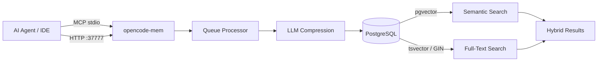

<div align="center">

# opencode-mem

**Persistent memory infrastructure for AI coding agents.**

A Rust MCP server combining PostgreSQL full-text search, optional vector
retrieval, and hierarchical summaries.

[](https://github.com/Stranmor/opencode-mem/actions)
[](LICENSE)
[](https://www.rust-lang.org)
[](https://github.com/Stranmor/opencode-mem/stargazers)
[](https://github.com/Stranmor/opencode-mem/issues)

</div>

---

`opencode-mem` is a Rust [MCP](https://modelcontextprotocol.io/) (Model Context Protocol) server for storing and retrieving agent observations. PostgreSQL is the canonical store; pgvector-backed embeddings and hierarchical summaries provide additional retrieval paths when configured.

Inspired by [claude-mem](https://github.com/thedotmack/claude-mem), with a PostgreSQL-first architecture for OpenCode and MCP clients.

## Core design

| Area | Current implementation |
|------|------------------------|
| Runtime | Rust workspace with MCP stdio, HTTP, and CLI entrypoints |
| Storage | PostgreSQL, with pgvector used for vector retrieval |
| Retrieval | Full-text, keyword, semantic, and hybrid search paths |
| Memory pipeline | Queued observations, structured summaries, and drill-down |
| Privacy boundary | `<private>` filtering before persistence and model calls |
| Recovery | Visibility timeouts, dead-letter handling, and degraded-mode responses |

## Implemented paths

- Hierarchical summaries can be expanded back to their stored source events.
- Hybrid retrieval combines PostgreSQL full-text results with vector similarity when embeddings are enabled.
- Structured metadata extraction records files, functions, libraries, errors, and decisions from model output.
- Context-aware compression can create a new observation, update a supplied candidate, or skip a low-value result.
- MCP, HTTP, and CLI entrypoints share the same PostgreSQL-backed service layer.
- Database connection failures are surfaced through circuit-breaker and degraded-mode paths.

## Architecture


```mermaid
graph LR
    A[AI Agent / IDE] -->|MCP stdio| B[opencode-mem]
    A -->|HTTP :37777| B
    B --> C[Queue Processor]
    C --> D[LLM Compression]
    D --> E[(PostgreSQL)]
    E -->|pgvector| F[Semantic Search]
    E -->|tsvector / GIN| G[Full-Text Search]
    F & G --> H[Hybrid Results]
```

### Crate Structure

```text
crates/
├── core/              # Domain types (Observation, Session, Knowledge, etc.)
├── storage/           # PostgreSQL + pgvector + migrations + circuit breaker
├── embeddings/        # Vector embeddings (fastembed BGE-M3, 1024d, multilingual)
├── search/            # Hybrid search (FTS + keyword + semantic)
├── llm/               # LLM compression (OpenAI-compatible API)
├── service/           # Business logic (ObservationService, SessionService, QueueService)
├── http/              # HTTP API (Axum)
├── mcp/               # MCP server (stdio)
├── infinite-memory/   # Hierarchical infinite memory backend
└── cli/               # CLI binary
```

## Installation

### From source

```bash
git clone https://github.com/Stranmor/opencode-mem.git
cd opencode-mem
cargo build --release
# Binary: target/release/opencode-mem-cli
```

## Quick Start

**Prerequisites:** Rust 1.88+ · PostgreSQL with [`pgvector`](https://github.com/pgvector/pgvector) extension

### 1. Configure

```bash
export DATABASE_URL="postgresql://localhost/opencode_mem"
read -rsp "Provider API key: " OPENCODE_MEM_API_KEY && printf '\n'
export OPENCODE_MEM_API_KEY
export OPENCODE_MEM_API_URL="https://api.openai.com"  # or any compatible endpoint
```

Use a credential manager or protected environment file for persistent secrets;
do not commit database passwords or provider keys to `opencode.json`.

Migrations run automatically on first start.

### 2. Run

```bash
# MCP server (for IDE integration):
opencode-mem-cli mcp

# HTTP server (for dashboards and external integrations):
opencode-mem-cli serve
```

### 3. Integrate with OpenCode

Add to your `opencode.json`. OpenCode substitutes the already exported
environment variables at runtime, so the config remains safe to commit:

```json
{
  "$schema": "https://opencode.ai/config.json",
  "mcp": {
    "memory": {
      "type": "local",
      "command": ["/path/to/opencode-mem-cli", "mcp"],
      "environment": {
        "DATABASE_URL": "{env:DATABASE_URL}",
        "OPENCODE_MEM_API_KEY": "{env:OPENCODE_MEM_API_KEY}",
        "OPENCODE_MEM_API_URL": "{env:OPENCODE_MEM_API_URL}"
      }
    }
  }
}
```

## MCP Tools

The server exposes MCP tools for search, retrieval, knowledge, and summary drill-down. The recommended workflow is **Search → Timeline → Get Observations** so clients fetch full records only when needed.

| Tool | Description |
|------|-------------|
| `search` | Search memory with semantic understanding. Returns index with IDs. |
| `timeline` | Get chronological context within a time range. |
| `get_observations` | Fetch full details for specific observation IDs. |
| `memory_get` | Get a single observation by ID. |
| `memory_recent` | Get the most recent observations. |
| `memory_hybrid_search` | Combined FTS + keyword search. |
| `memory_semantic_search` | Pure semantic search with hybrid fallback. |
| `save_memory` | Save memory directly (bypasses LLM compression). |
| `knowledge_search` | Search the global knowledge base. |
| `knowledge_save` | Save a new knowledge entry (skill, pattern, gotcha). |
| `knowledge_get` | Get a knowledge entry by ID. |
| `knowledge_list` | List knowledge entries by type. |
| `knowledge_delete` | Delete a knowledge entry. |
| `infinite_expand` | Expand a summary to see child events. |
| `infinite_time_range` | Get events within a time range. |
| `infinite_drill_hour` | Drill from day summary to hour summaries. |
| `infinite_drill_minute` | Drill from hour summary to 5-minute summaries. |
| `__IMPORTANT` | Workflow documentation (3-Layer Pattern). |

## HTTP API

HTTP endpoints are organized across the following handler modules:

- **`observations`** — CRUD and bulk operations for observations
- **`sessions`** / **`sessions_api`** — Session lifecycle, summaries, retrieval
- **`session_ops`** — Advanced operations (merge, split, archive)
- **`infinite`** — Deep-zoom endpoints (`expand_summary`, `time_range`, `drill_hour`, `drill_minute`)
- **`search`** — Semantic, FTS, and hybrid search
- **`knowledge`** — Global knowledge base management
- **`queue`** — Pending queue and DLQ inspection
- **`context`** — Context compilation for agent injection
- **`admin`** — Health checks, configuration, diagnostics

## CLI

```bash
# Server
opencode-mem-cli serve                 # HTTP API server (port 37777)
opencode-mem-cli mcp                   # MCP stdio server

# Maintenance
opencode-mem-cli backfill-embeddings   # Generate missing vector embeddings
opencode-mem-cli import-insights       # Import legacy JSON insights

# Data Access
opencode-mem-cli search <query>        # Search observations
opencode-mem-cli get <id>              # Get observation by UUID
opencode-mem-cli recent                # Recent observations
opencode-mem-cli projects              # List tracked projects
opencode-mem-cli stats                 # Database statistics and queue health

# IDE Hooks
opencode-mem-cli hook context          # Retrieve context for prompt injection
opencode-mem-cli hook session-init     # Initialize a new session
opencode-mem-cli hook observe          # Record an observation
opencode-mem-cli hook summarize        # Trigger session summarization
```

## Configuration

All configuration is via environment variables:

| Variable | Required | Default | Description |
|----------|----------|---------|-------------|
| `DATABASE_URL` | **Yes** | — | PostgreSQL connection string |
| `OPENCODE_MEM_API_KEY` | **Yes** | — | API key for the LLM provider |
| `OPENCODE_MEM_API_URL` | No | `https://api.openai.com` | OpenAI-compatible API base URL |
| `OPENCODE_MEM_MODEL` | No | — | Model for compression (e.g., `gpt-4o`) |
| `OPENCODE_MEM_DISABLE_EMBEDDINGS` | No | `false` | Disable vector embeddings (`1` or `true`) |
| `INFINITE_MEMORY_URL` | No | `DATABASE_URL` | Separate DB for infinite memory |
| `OPENCODE_MEM_EXCLUDED_PROJECTS` | No | — | Glob patterns for excluded projects |
| `OPENCODE_MEM_FILTER_PATTERNS` | No | — | Custom noise filter patterns (regex) |
| `OPENCODE_MEM_DEDUP_THRESHOLD` | No | `0.85` | Cosine similarity for dedup `[0.0, 1.0]` |
| `OPENCODE_MEM_INJECTION_DEDUP_THRESHOLD` | No | `0.80` | IDE injection loop detection `[0.0, 1.0]` |
| `OPENCODE_MEM_EMBEDDING_THREADS` | No | `cores - 1` | ONNX embedding threads |
| `OPENCODE_MEM_MAX_RETRY` | No | `3` | LLM compression retries |
| `OPENCODE_MEM_VISIBILITY_TIMEOUT` | No | `300s` | Queue visibility timeout |
| `OPENCODE_MEM_QUEUE_WORKERS` | No | `10` | Concurrent queue workers |
| `OPENCODE_MEM_DLQ_TTL_DAYS` | No | `7` | Dead letter queue retention |
| `OPENCODE_MEM_MAX_CONTENT_CHARS` | No | `500` | Max chars per observation field |
| `OPENCODE_MEM_MAX_TOTAL_CHARS` | No | `8000` | Max chars for LLM prompt |
| `OPENCODE_MEM_MAX_EVENTS` | No | `200` | Max raw events per memory chunk |

## Development

### Prerequisites

- Rust 1.88+
- PostgreSQL with `pgvector` extension
- An OpenAI-compatible LLM API (for compression features)

### Running Tests

```bash
export DATABASE_URL="postgresql://localhost/opencode_mem_test"

# Unit tests (no DB required)
cargo test --workspace

# Integration tests (requires running PostgreSQL)
cargo test --workspace -- --ignored
```

### Code Quality

```bash
cargo fmt --all
cargo clippy --workspace -- -D warnings
```

### Development constraints

- PostgreSQL remains the canonical persistence path.
- Missing or invalid data returns an explicit error or absence, not a fabricated value.
- Schema changes use forward migrations and preserve existing data.
- Privacy filtering must remain ahead of persistence, queues, embeddings, summaries, logs, and external model calls.

## Project Status

Active pre-release project. Core MCP, HTTP, PostgreSQL, queue, and search paths are implemented, but release readiness depends on the current CI result and validation against a real OpenCode consumer. IDE-specific hooks remain outside the current scope. Infinite memory and semantic search should be treated as experimental until their deployment requirements and failure modes are documented and exercised end to end.

## Contributing

Contributions welcome! See [CONTRIBUTING.md](CONTRIBUTING.md) for development setup and guidelines.

## License

[MIT](LICENSE)
